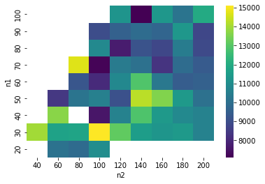

```python
from backtesting.test import GOOG

GOOG.tail()

```

    C:\Users\86189\anaconda3\lib\site-packages\backtesting\_plotting.py:50: UserWarning: Jupyter Notebook detected. Setting Bokeh output to notebook. This may not work in Jupyter clients without JavaScript support (e.g. PyCharm, Spyder IDE). Reset with `backtesting.set_bokeh_output(notebook=False)`.
      warnings.warn('Jupyter Notebook detected. '
    


<div class="bk-root">
    <a href="https://bokeh.org" target="_blank" class="bk-logo bk-logo-small bk-logo-notebook"></a>
    <span id="1002">Loading BokehJS ...</span>
</div>


<div>
<style scoped>
    .dataframe tbody tr th:only-of-type {
        vertical-align: middle;
    }

    .dataframe tbody tr th {
        vertical-align: top;
    }

    .dataframe thead th {
        text-align: right;
    }
</style>
<table border="1" class="dataframe">
  <thead>
    <tr style="text-align: right;">
      <th></th>
      <th>Open</th>
      <th>High</th>
      <th>Low</th>
      <th>Close</th>
      <th>Volume</th>
    </tr>
  </thead>
  <tbody>
    <tr>
      <th>2013-02-25</th>
      <td>802.3</td>
      <td>808.41</td>
      <td>790.49</td>
      <td>790.77</td>
      <td>2303900</td>
    </tr>
    <tr>
      <th>2013-02-26</th>
      <td>795.0</td>
      <td>795.95</td>
      <td>784.40</td>
      <td>790.13</td>
      <td>2202500</td>
    </tr>
    <tr>
      <th>2013-02-27</th>
      <td>794.8</td>
      <td>804.75</td>
      <td>791.11</td>
      <td>799.78</td>
      <td>2026100</td>
    </tr>
    <tr>
      <th>2013-02-28</th>
      <td>801.1</td>
      <td>806.99</td>
      <td>801.03</td>
      <td>801.20</td>
      <td>2265800</td>
    </tr>
    <tr>
      <th>2013-03-01</th>
      <td>797.8</td>
      <td>807.14</td>
      <td>796.15</td>
      <td>806.19</td>
      <td>2175400</td>
    </tr>
  </tbody>
</table>
</div>


```python
pip install backtesting
```

    Requirement already satisfied: backtesting in c:\users\86189\anaconda3\lib\site-packages (0.3.3)
    Requirement already satisfied: pandas!=0.25.0,>=0.25.0 in c:\users\86189\anaconda3\lib\site-packages (from backtesting) (1.3.4)
    Requirement already satisfied: bokeh>=1.4.0 in c:\users\86189\anaconda3\lib\site-packages (from backtesting) (2.4.1)
    Requirement already satisfied: numpy>=1.17.0 in c:\users\86189\anaconda3\lib\site-packages (from backtesting) (1.20.3)
    Requirement already satisfied: PyYAML>=3.10 in c:\users\86189\anaconda3\lib\site-packages (from bokeh>=1.4.0->backtesting) (6.0)
    Requirement already satisfied: Jinja2>=2.9 in c:\users\86189\anaconda3\lib\site-packages (from bokeh>=1.4.0->backtesting) (2.11.3)
    Requirement already satisfied: tornado>=5.1 in c:\users\86189\anaconda3\lib\site-packages (from bokeh>=1.4.0->backtesting) (6.1)
    Requirement already satisfied: pillow>=7.1.0 in c:\users\86189\anaconda3\lib\site-packages (from bokeh>=1.4.0->backtesting) (8.4.0)
    Requirement already satisfied: packaging>=16.8 in c:\users\86189\anaconda3\lib\site-packages (from bokeh>=1.4.0->backtesting) (24.0)
    Requirement already satisfied: typing-extensions>=3.10.0 in c:\users\86189\anaconda3\lib\site-packages (from bokeh>=1.4.0->backtesting) (3.10.0.2)
    Requirement already satisfied: MarkupSafe>=0.23 in c:\users\86189\anaconda3\lib\site-packages (from Jinja2>=2.9->bokeh>=1.4.0->backtesting) (1.1.1)
    Requirement already satisfied: pytz>=2017.3 in c:\users\86189\anaconda3\lib\site-packages (from pandas!=0.25.0,>=0.25.0->backtesting) (2021.3)
    Requirement already satisfied: python-dateutil>=2.7.3 in c:\users\86189\anaconda3\lib\site-packages (from pandas!=0.25.0,>=0.25.0->backtesting) (2.8.2)
    Requirement already satisfied: six>=1.5 in c:\users\86189\anaconda3\lib\site-packages (from python-dateutil>=2.7.3->pandas!=0.25.0,>=0.25.0->backtesting) (1.16.0)
    Note: you may need to restart the kernel to use updated packages.
    


```python
from backtesting.test import GOOG

GOOG.tail()
```


<div>
<style scoped>
    .dataframe tbody tr th:only-of-type {
        vertical-align: middle;
    }

    .dataframe tbody tr th {
        vertical-align: top;
    }

    .dataframe thead th {
        text-align: right;
    }
</style>
<table border="1" class="dataframe">
  <thead>
    <tr style="text-align: right;">
      <th></th>
      <th>Open</th>
      <th>High</th>
      <th>Low</th>
      <th>Close</th>
      <th>Volume</th>
    </tr>
  </thead>
  <tbody>
    <tr>
      <th>2013-02-25</th>
      <td>802.3</td>
      <td>808.41</td>
      <td>790.49</td>
      <td>790.77</td>
      <td>2303900</td>
    </tr>
    <tr>
      <th>2013-02-26</th>
      <td>795.0</td>
      <td>795.95</td>
      <td>784.40</td>
      <td>790.13</td>
      <td>2202500</td>
    </tr>
    <tr>
      <th>2013-02-27</th>
      <td>794.8</td>
      <td>804.75</td>
      <td>791.11</td>
      <td>799.78</td>
      <td>2026100</td>
    </tr>
    <tr>
      <th>2013-02-28</th>
      <td>801.1</td>
      <td>806.99</td>
      <td>801.03</td>
      <td>801.20</td>
      <td>2265800</td>
    </tr>
    <tr>
      <th>2013-03-01</th>
      <td>797.8</td>
      <td>807.14</td>
      <td>796.15</td>
      <td>806.19</td>
      <td>2175400</td>
    </tr>
  </tbody>
</table>
</div>


```python
pip install ta-lib
```

    Requirement already satisfied: ta-lib in c:\users\86189\anaconda3\lib\site-packages (0.4.19)
    Requirement already satisfied: numpy in c:\users\86189\anaconda3\lib\site-packages (from ta-lib) (1.20.3)
    Note: you may need to restart the kernel to use updated packages.
    


```python
pip install pandas_ta
```

    Requirement already satisfied: pandas_ta in c:\users\86189\anaconda3\lib\site-packages (0.3.14b0)
    Requirement already satisfied: pandas in c:\users\86189\anaconda3\lib\site-packages (from pandas_ta) (1.3.4)
    Requirement already satisfied: numpy>=1.17.3 in c:\users\86189\anaconda3\lib\site-packages (from pandas->pandas_ta) (1.20.3)
    Requirement already satisfied: python-dateutil>=2.7.3 in c:\users\86189\anaconda3\lib\site-packages (from pandas->pandas_ta) (2.8.2)
    Requirement already satisfied: pytz>=2017.3 in c:\users\86189\anaconda3\lib\site-packages (from pandas->pandas_ta) (2021.3)
    Requirement already satisfied: six>=1.5 in c:\users\86189\anaconda3\lib\site-packages (from python-dateutil>=2.7.3->pandas->pandas_ta) (1.16.0)
    Note: you may need to restart the kernel to use updated packages.
    


```python
pip install ta-lib
```

    Requirement already satisfied: ta-lib in c:\users\86189\anaconda3\lib\site-packages (0.4.19)
    Requirement already satisfied: numpy in c:\users\86189\anaconda3\lib\site-packages (from ta-lib) (1.20.3)
    Note: you may need to restart the kernel to use updated packages.
    


```python
import datetime
import pandas_ta as ta
import pandas as pd

from backtesting import Backtest
from backtesting import Strategy
from backtesting.lib import crossover
from backtesting.test import GOOG

class RsiOscillator(Strategy):

    upper_bound = 70
    lower_bound = 30
    rsi_window = 14

    # Do as much initial computation as possible
    def init(self):
        self.rsi = self.I(ta.rsi, pd.Series(self.data.Close), self.rsi_window)

    # Step through bars one by one
    # Note that multiple buys are a thing here
    def next(self):
        if crossover(self.rsi, self.upper_bound):
            self.position.close()
        elif crossover(self.lower_bound, self.rsi):
            self.buy()

bt = Backtest(GOOG, RsiOscillator, cash=10_000, commission=.002)
stats = bt.run()
bt.plot()

```


<div class="bk-root" id="0ea50a4c-32fa-4507-9169-04971729a244" data-root-id="1476"></div>


<div style="display: table;"><div style="display: table-row;"><div style="display: table-cell;"><b title="bokeh.models.layouts.Row">Row</b>(</div><div style="display: table-cell;">id&nbsp;=&nbsp;'1476', <span id="1814" style="cursor: pointer;">&hellip;)</span></div></div><div class="1813" style="display: none;"><div style="display: table-cell;"></div><div style="display: table-cell;">align&nbsp;=&nbsp;'start',</div></div><div class="1813" style="display: none;"><div style="display: table-cell;"></div><div style="display: table-cell;">aspect_ratio&nbsp;=&nbsp;None,</div></div><div class="1813" style="display: none;"><div style="display: table-cell;"></div><div style="display: table-cell;">background&nbsp;=&nbsp;None,</div></div><div class="1813" style="display: none;"><div style="display: table-cell;"></div><div style="display: table-cell;">children&nbsp;=&nbsp;[GridBox(id='1473', ...), ToolbarBox(id='1475', ...)],</div></div><div class="1813" style="display: none;"><div style="display: table-cell;"></div><div style="display: table-cell;">cols&nbsp;=&nbsp;'auto',</div></div><div class="1813" style="display: none;"><div style="display: table-cell;"></div><div style="display: table-cell;">css_classes&nbsp;=&nbsp;[],</div></div><div class="1813" style="display: none;"><div style="display: table-cell;"></div><div style="display: table-cell;">disabled&nbsp;=&nbsp;False,</div></div><div class="1813" style="display: none;"><div style="display: table-cell;"></div><div style="display: table-cell;">height&nbsp;=&nbsp;None,</div></div><div class="1813" style="display: none;"><div style="display: table-cell;"></div><div style="display: table-cell;">height_policy&nbsp;=&nbsp;'auto',</div></div><div class="1813" style="display: none;"><div style="display: table-cell;"></div><div style="display: table-cell;">js_event_callbacks&nbsp;=&nbsp;{},</div></div><div class="1813" style="display: none;"><div style="display: table-cell;"></div><div style="display: table-cell;">js_property_callbacks&nbsp;=&nbsp;{},</div></div><div class="1813" style="display: none;"><div style="display: table-cell;"></div><div style="display: table-cell;">margin&nbsp;=&nbsp;(0, 0, 0, 0),</div></div><div class="1813" style="display: none;"><div style="display: table-cell;"></div><div style="display: table-cell;">max_height&nbsp;=&nbsp;None,</div></div><div class="1813" style="display: none;"><div style="display: table-cell;"></div><div style="display: table-cell;">max_width&nbsp;=&nbsp;None,</div></div><div class="1813" style="display: none;"><div style="display: table-cell;"></div><div style="display: table-cell;">min_height&nbsp;=&nbsp;None,</div></div><div class="1813" style="display: none;"><div style="display: table-cell;"></div><div style="display: table-cell;">min_width&nbsp;=&nbsp;None,</div></div><div class="1813" style="display: none;"><div style="display: table-cell;"></div><div style="display: table-cell;">name&nbsp;=&nbsp;None,</div></div><div class="1813" style="display: none;"><div style="display: table-cell;"></div><div style="display: table-cell;">sizing_mode&nbsp;=&nbsp;'stretch_width',</div></div><div class="1813" style="display: none;"><div style="display: table-cell;"></div><div style="display: table-cell;">spacing&nbsp;=&nbsp;0,</div></div><div class="1813" style="display: none;"><div style="display: table-cell;"></div><div style="display: table-cell;">subscribed_events&nbsp;=&nbsp;[],</div></div><div class="1813" style="display: none;"><div style="display: table-cell;"></div><div style="display: table-cell;">syncable&nbsp;=&nbsp;True,</div></div><div class="1813" style="display: none;"><div style="display: table-cell;"></div><div style="display: table-cell;">tags&nbsp;=&nbsp;[],</div></div><div class="1813" style="display: none;"><div style="display: table-cell;"></div><div style="display: table-cell;">visible&nbsp;=&nbsp;True,</div></div><div class="1813" style="display: none;"><div style="display: table-cell;"></div><div style="display: table-cell;">width&nbsp;=&nbsp;None,</div></div><div class="1813" style="display: none;"><div style="display: table-cell;"></div><div style="display: table-cell;">width_policy&nbsp;=&nbsp;'auto')</div></div></div>
<script>
(function() {
  let expanded = false;
  const ellipsis = document.getElementById("1814");
  ellipsis.addEventListener("click", function() {
    const rows = document.getElementsByClassName("1813");
    for (let i = 0; i < rows.length; i++) {
      const el = rows[i];
      el.style.display = expanded ? "none" : "table-row";
    }
    ellipsis.innerHTML = expanded ? "&hellip;)" : "&lsaquo;&lsaquo;&lsaquo;";
    expanded = !expanded;
  });
})();
</script>


```python
import pandas as pd


def SMA(values, n):
    """
    Return simple moving average of `values`, at
    each step taking into account `n` previous values.
    """
    return pd.Series(values).rolling(n).mean()
```


```python
from backtesting import Strategy
from backtesting.lib import crossover


class SmaCross(Strategy):
    # Define the two MA lags as *class variables*
    # for later optimization
    n1 = 10
    n2 = 20
    
    def init(self):
        # Precompute the two moving averages
        self.sma1 = self.I(SMA, self.data.Close, self.n1)
        self.sma2 = self.I(SMA, self.data.Close, self.n2)
    
    def next(self):
        # If sma1 crosses above sma2, close any existing
        # short trades, and buy the asset
        if crossover(self.sma1, self.sma2):
            self.position.close()
            self.buy()

        # Else, if sma1 crosses below sma2, close any existing
        # long trades, and sell the asset
        elif crossover(self.sma2, self.sma1):
            self.position.close()
            self.sell()
```


```python


    def next(self):
        if (self.sma1[-2] < self.sma2[-2] and
                self.sma1[-1] > self.sma2[-1]):
            self.position.close()
            self.buy()

        elif (self.sma1[-2] > self.sma2[-2] and    # Ugh!
              self.sma1[-1] < self.sma2[-1]):
            self.position.close()
            self.sell()
```


```python
from backtesting import Backtest

bt = Backtest(GOOG, SmaCross, cash=10_000, commission=.002)
stats = bt.run()
stats
```


    Start                     2004-08-19 00:00:00
    End                       2013-03-01 00:00:00
    Duration                   3116 days 00:00:00
    Exposure Time [%]                   97.067039
    Equity Final [$]                  68221.96986
    Equity Peak [$]                   68991.21986
    Return [%]                         582.219699
    Buy & Hold Return [%]              703.458242
    Return (Ann.) [%]                   25.266427
    Volatility (Ann.) [%]               38.383008
    Sharpe Ratio                         0.658271
    Sortino Ratio                        1.288779
    Calmar Ratio                         0.763748
    Max. Drawdown [%]                  -33.082172
    Avg. Drawdown [%]                   -5.581506
    Max. Drawdown Duration      688 days 00:00:00
    Avg. Drawdown Duration       41 days 00:00:00
    # Trades                                   94
    Win Rate [%]                        54.255319
    Best Trade [%]                       57.11931
    Worst Trade [%]                    -16.629898
    Avg. Trade [%]                       2.074326
    Max. Trade Duration         121 days 00:00:00
    Avg. Trade Duration          33 days 00:00:00
    Profit Factor                        2.190805
    Expectancy [%]                       2.606294
    SQN                                  1.990216
    _strategy                            SmaCross
    _equity_curve                             ...
    _trades                       Size  EntryB...
    dtype: object


```python
bt.plot()
```


<div class="bk-root" id="9983eee7-76e5-45a8-9fa9-b16d97193753" data-root-id="2262"></div>


<div style="display: table;"><div style="display: table-row;"><div style="display: table-cell;"><b title="bokeh.models.layouts.Row">Row</b>(</div><div style="display: table-cell;">id&nbsp;=&nbsp;'2262', <span id="2546" style="cursor: pointer;">&hellip;)</span></div></div><div class="2545" style="display: none;"><div style="display: table-cell;"></div><div style="display: table-cell;">align&nbsp;=&nbsp;'start',</div></div><div class="2545" style="display: none;"><div style="display: table-cell;"></div><div style="display: table-cell;">aspect_ratio&nbsp;=&nbsp;None,</div></div><div class="2545" style="display: none;"><div style="display: table-cell;"></div><div style="display: table-cell;">background&nbsp;=&nbsp;None,</div></div><div class="2545" style="display: none;"><div style="display: table-cell;"></div><div style="display: table-cell;">children&nbsp;=&nbsp;[GridBox(id='2259', ...), ToolbarBox(id='2261', ...)],</div></div><div class="2545" style="display: none;"><div style="display: table-cell;"></div><div style="display: table-cell;">cols&nbsp;=&nbsp;'auto',</div></div><div class="2545" style="display: none;"><div style="display: table-cell;"></div><div style="display: table-cell;">css_classes&nbsp;=&nbsp;[],</div></div><div class="2545" style="display: none;"><div style="display: table-cell;"></div><div style="display: table-cell;">disabled&nbsp;=&nbsp;False,</div></div><div class="2545" style="display: none;"><div style="display: table-cell;"></div><div style="display: table-cell;">height&nbsp;=&nbsp;None,</div></div><div class="2545" style="display: none;"><div style="display: table-cell;"></div><div style="display: table-cell;">height_policy&nbsp;=&nbsp;'auto',</div></div><div class="2545" style="display: none;"><div style="display: table-cell;"></div><div style="display: table-cell;">js_event_callbacks&nbsp;=&nbsp;{},</div></div><div class="2545" style="display: none;"><div style="display: table-cell;"></div><div style="display: table-cell;">js_property_callbacks&nbsp;=&nbsp;{},</div></div><div class="2545" style="display: none;"><div style="display: table-cell;"></div><div style="display: table-cell;">margin&nbsp;=&nbsp;(0, 0, 0, 0),</div></div><div class="2545" style="display: none;"><div style="display: table-cell;"></div><div style="display: table-cell;">max_height&nbsp;=&nbsp;None,</div></div><div class="2545" style="display: none;"><div style="display: table-cell;"></div><div style="display: table-cell;">max_width&nbsp;=&nbsp;None,</div></div><div class="2545" style="display: none;"><div style="display: table-cell;"></div><div style="display: table-cell;">min_height&nbsp;=&nbsp;None,</div></div><div class="2545" style="display: none;"><div style="display: table-cell;"></div><div style="display: table-cell;">min_width&nbsp;=&nbsp;None,</div></div><div class="2545" style="display: none;"><div style="display: table-cell;"></div><div style="display: table-cell;">name&nbsp;=&nbsp;None,</div></div><div class="2545" style="display: none;"><div style="display: table-cell;"></div><div style="display: table-cell;">sizing_mode&nbsp;=&nbsp;'stretch_width',</div></div><div class="2545" style="display: none;"><div style="display: table-cell;"></div><div style="display: table-cell;">spacing&nbsp;=&nbsp;0,</div></div><div class="2545" style="display: none;"><div style="display: table-cell;"></div><div style="display: table-cell;">subscribed_events&nbsp;=&nbsp;[],</div></div><div class="2545" style="display: none;"><div style="display: table-cell;"></div><div style="display: table-cell;">syncable&nbsp;=&nbsp;True,</div></div><div class="2545" style="display: none;"><div style="display: table-cell;"></div><div style="display: table-cell;">tags&nbsp;=&nbsp;[],</div></div><div class="2545" style="display: none;"><div style="display: table-cell;"></div><div style="display: table-cell;">visible&nbsp;=&nbsp;True,</div></div><div class="2545" style="display: none;"><div style="display: table-cell;"></div><div style="display: table-cell;">width&nbsp;=&nbsp;None,</div></div><div class="2545" style="display: none;"><div style="display: table-cell;"></div><div style="display: table-cell;">width_policy&nbsp;=&nbsp;'auto')</div></div></div>
<script>
(function() {
  let expanded = false;
  const ellipsis = document.getElementById("2546");
  ellipsis.addEventListener("click", function() {
    const rows = document.getElementsByClassName("2545");
    for (let i = 0; i < rows.length; i++) {
      const el = rows[i];
      el.style.display = expanded ? "none" : "table-row";
    }
    ellipsis.innerHTML = expanded ? "&hellip;)" : "&lsaquo;&lsaquo;&lsaquo;";
    expanded = !expanded;
  });
})();
</script>


```python
stats = bt.optimize(n1=range(5, 30, 5),
                    n2=range(10, 70, 5),
                    maximize='Equity Final [$]',
                    constraint=lambda param: param.n1 < param.n2)
stats
```


      0%|          | 0/9 [00:00<?, ?it/s]


    Start                     2004-08-19 00:00:00
    End                       2013-03-01 00:00:00
    Duration                   3116 days 00:00:00
    Exposure Time [%]                   99.068901
    Equity Final [$]                 103949.42612
    Equity Peak [$]                  108327.71798
    Return [%]                         939.494261
    Buy & Hold Return [%]              703.458242
    Return (Ann.) [%]                   31.610936
    Volatility (Ann.) [%]               44.739816
    Sharpe Ratio                          0.70655
    Sortino Ratio                        1.490961
    Calmar Ratio                         0.718505
    Max. Drawdown [%]                  -43.995445
    Avg. Drawdown [%]                   -6.138853
    Max. Drawdown Duration      690 days 00:00:00
    Avg. Drawdown Duration       43 days 00:00:00
    # Trades                                  153
    Win Rate [%]                        51.633987
    Best Trade [%]                      61.562908
    Worst Trade [%]                    -19.778312
    Avg. Trade [%]                       1.550283
    Max. Trade Duration          83 days 00:00:00
    Avg. Trade Duration          21 days 00:00:00
    Profit Factor                        1.984581
    Expectancy [%]                        1.97988
    SQN                                  1.604158
    _strategy                 SmaCross(n1=10,n...
    _equity_curve                             ...
    _trades                        Size  Entry...
    dtype: object


```python
stats._strategy
```


    <Strategy SmaCross(n1=10,n2=15)>


```python
bt.plot(plot_volume=False, plot_pl=False)
```


<div class="bk-root" id="bf13f0d2-0a5c-4c6c-b39b-e125ea6936ee" data-root-id="2871"></div>


<div style="display: table;"><div style="display: table-row;"><div style="display: table-cell;"><b title="bokeh.models.layouts.Row">Row</b>(</div><div style="display: table-cell;">id&nbsp;=&nbsp;'2871', <span id="3065" style="cursor: pointer;">&hellip;)</span></div></div><div class="3064" style="display: none;"><div style="display: table-cell;"></div><div style="display: table-cell;">align&nbsp;=&nbsp;'start',</div></div><div class="3064" style="display: none;"><div style="display: table-cell;"></div><div style="display: table-cell;">aspect_ratio&nbsp;=&nbsp;None,</div></div><div class="3064" style="display: none;"><div style="display: table-cell;"></div><div style="display: table-cell;">background&nbsp;=&nbsp;None,</div></div><div class="3064" style="display: none;"><div style="display: table-cell;"></div><div style="display: table-cell;">children&nbsp;=&nbsp;[GridBox(id='2868', ...), ToolbarBox(id='2870', ...)],</div></div><div class="3064" style="display: none;"><div style="display: table-cell;"></div><div style="display: table-cell;">cols&nbsp;=&nbsp;'auto',</div></div><div class="3064" style="display: none;"><div style="display: table-cell;"></div><div style="display: table-cell;">css_classes&nbsp;=&nbsp;[],</div></div><div class="3064" style="display: none;"><div style="display: table-cell;"></div><div style="display: table-cell;">disabled&nbsp;=&nbsp;False,</div></div><div class="3064" style="display: none;"><div style="display: table-cell;"></div><div style="display: table-cell;">height&nbsp;=&nbsp;None,</div></div><div class="3064" style="display: none;"><div style="display: table-cell;"></div><div style="display: table-cell;">height_policy&nbsp;=&nbsp;'auto',</div></div><div class="3064" style="display: none;"><div style="display: table-cell;"></div><div style="display: table-cell;">js_event_callbacks&nbsp;=&nbsp;{},</div></div><div class="3064" style="display: none;"><div style="display: table-cell;"></div><div style="display: table-cell;">js_property_callbacks&nbsp;=&nbsp;{},</div></div><div class="3064" style="display: none;"><div style="display: table-cell;"></div><div style="display: table-cell;">margin&nbsp;=&nbsp;(0, 0, 0, 0),</div></div><div class="3064" style="display: none;"><div style="display: table-cell;"></div><div style="display: table-cell;">max_height&nbsp;=&nbsp;None,</div></div><div class="3064" style="display: none;"><div style="display: table-cell;"></div><div style="display: table-cell;">max_width&nbsp;=&nbsp;None,</div></div><div class="3064" style="display: none;"><div style="display: table-cell;"></div><div style="display: table-cell;">min_height&nbsp;=&nbsp;None,</div></div><div class="3064" style="display: none;"><div style="display: table-cell;"></div><div style="display: table-cell;">min_width&nbsp;=&nbsp;None,</div></div><div class="3064" style="display: none;"><div style="display: table-cell;"></div><div style="display: table-cell;">name&nbsp;=&nbsp;None,</div></div><div class="3064" style="display: none;"><div style="display: table-cell;"></div><div style="display: table-cell;">sizing_mode&nbsp;=&nbsp;'stretch_width',</div></div><div class="3064" style="display: none;"><div style="display: table-cell;"></div><div style="display: table-cell;">spacing&nbsp;=&nbsp;0,</div></div><div class="3064" style="display: none;"><div style="display: table-cell;"></div><div style="display: table-cell;">subscribed_events&nbsp;=&nbsp;[],</div></div><div class="3064" style="display: none;"><div style="display: table-cell;"></div><div style="display: table-cell;">syncable&nbsp;=&nbsp;True,</div></div><div class="3064" style="display: none;"><div style="display: table-cell;"></div><div style="display: table-cell;">tags&nbsp;=&nbsp;[],</div></div><div class="3064" style="display: none;"><div style="display: table-cell;"></div><div style="display: table-cell;">visible&nbsp;=&nbsp;True,</div></div><div class="3064" style="display: none;"><div style="display: table-cell;"></div><div style="display: table-cell;">width&nbsp;=&nbsp;None,</div></div><div class="3064" style="display: none;"><div style="display: table-cell;"></div><div style="display: table-cell;">width_policy&nbsp;=&nbsp;'auto')</div></div></div>
<script>
(function() {
  let expanded = false;
  const ellipsis = document.getElementById("3065");
  ellipsis.addEventListener("click", function() {
    const rows = document.getElementsByClassName("3064");
    for (let i = 0; i < rows.length; i++) {
      const el = rows[i];
      el.style.display = expanded ? "none" : "table-row";
    }
    ellipsis.innerHTML = expanded ? "&hellip;)" : "&lsaquo;&lsaquo;&lsaquo;";
    expanded = !expanded;
  });
})();
</script>


```python
stats.tail()
```


    Expectancy [%]                                              1.97988
    SQN                                                        1.604158
    _strategy                                     SmaCross(n1=10,n2=15)
    _equity_curve                       Equity  DrawdownPct Drawdown...
    _trades                Size  EntryBar  ExitBar  EntryPrice  Exit...
    dtype: object


```python
stats['_equity_curve']
```


<div>
<style scoped>
    .dataframe tbody tr th:only-of-type {
        vertical-align: middle;
    }

    .dataframe tbody tr th {
        vertical-align: top;
    }

    .dataframe thead th {
        text-align: right;
    }
</style>
<table border="1" class="dataframe">
  <thead>
    <tr style="text-align: right;">
      <th></th>
      <th>Equity</th>
      <th>DrawdownPct</th>
      <th>DrawdownDuration</th>
    </tr>
  </thead>
  <tbody>
    <tr>
      <th>2004-08-19</th>
      <td>10000.00000</td>
      <td>0.000000</td>
      <td>NaT</td>
    </tr>
    <tr>
      <th>2004-08-20</th>
      <td>10000.00000</td>
      <td>0.000000</td>
      <td>NaT</td>
    </tr>
    <tr>
      <th>2004-08-23</th>
      <td>10000.00000</td>
      <td>0.000000</td>
      <td>NaT</td>
    </tr>
    <tr>
      <th>2004-08-24</th>
      <td>10000.00000</td>
      <td>0.000000</td>
      <td>NaT</td>
    </tr>
    <tr>
      <th>2004-08-25</th>
      <td>10000.00000</td>
      <td>0.000000</td>
      <td>NaT</td>
    </tr>
    <tr>
      <th>...</th>
      <td>...</td>
      <td>...</td>
      <td>...</td>
    </tr>
    <tr>
      <th>2013-02-25</th>
      <td>103035.52612</td>
      <td>0.048854</td>
      <td>NaT</td>
    </tr>
    <tr>
      <th>2013-02-26</th>
      <td>102952.32612</td>
      <td>0.049622</td>
      <td>NaT</td>
    </tr>
    <tr>
      <th>2013-02-27</th>
      <td>104206.82612</td>
      <td>0.038041</td>
      <td>NaT</td>
    </tr>
    <tr>
      <th>2013-02-28</th>
      <td>104391.42612</td>
      <td>0.036337</td>
      <td>NaT</td>
    </tr>
    <tr>
      <th>2013-03-01</th>
      <td>103949.42612</td>
      <td>0.040417</td>
      <td>533 days</td>
    </tr>
  </tbody>
</table>
<p>2148 rows × 3 columns</p>
</div>


```python
stats['_trades'] 
```


<div>
<style scoped>
    .dataframe tbody tr th:only-of-type {
        vertical-align: middle;
    }

    .dataframe tbody tr th {
        vertical-align: top;
    }

    .dataframe thead th {
        text-align: right;
    }
</style>
<table border="1" class="dataframe">
  <thead>
    <tr style="text-align: right;">
      <th></th>
      <th>Size</th>
      <th>EntryBar</th>
      <th>ExitBar</th>
      <th>EntryPrice</th>
      <th>ExitPrice</th>
      <th>PnL</th>
      <th>ReturnPct</th>
      <th>EntryTime</th>
      <th>ExitTime</th>
      <th>Duration</th>
    </tr>
  </thead>
  <tbody>
    <tr>
      <th>0</th>
      <td>87</td>
      <td>20</td>
      <td>60</td>
      <td>114.64884</td>
      <td>185.23</td>
      <td>6140.56092</td>
      <td>0.615629</td>
      <td>2004-09-17</td>
      <td>2004-11-12</td>
      <td>56 days</td>
    </tr>
    <tr>
      <th>1</th>
      <td>-87</td>
      <td>60</td>
      <td>69</td>
      <td>184.85954</td>
      <td>175.80</td>
      <td>788.17998</td>
      <td>0.049008</td>
      <td>2004-11-12</td>
      <td>2004-11-26</td>
      <td>14 days</td>
    </tr>
    <tr>
      <th>2</th>
      <td>96</td>
      <td>69</td>
      <td>71</td>
      <td>176.15160</td>
      <td>180.71</td>
      <td>437.60640</td>
      <td>0.025878</td>
      <td>2004-11-26</td>
      <td>2004-11-30</td>
      <td>4 days</td>
    </tr>
    <tr>
      <th>3</th>
      <td>-96</td>
      <td>71</td>
      <td>75</td>
      <td>180.34858</td>
      <td>179.13</td>
      <td>116.98368</td>
      <td>0.006757</td>
      <td>2004-11-30</td>
      <td>2004-12-06</td>
      <td>6 days</td>
    </tr>
    <tr>
      <th>4</th>
      <td>97</td>
      <td>75</td>
      <td>82</td>
      <td>179.48826</td>
      <td>177.99</td>
      <td>-145.33122</td>
      <td>-0.008347</td>
      <td>2004-12-06</td>
      <td>2004-12-15</td>
      <td>9 days</td>
    </tr>
    <tr>
      <th>...</th>
      <td>...</td>
      <td>...</td>
      <td>...</td>
      <td>...</td>
      <td>...</td>
      <td>...</td>
      <td>...</td>
      <td>...</td>
      <td>...</td>
      <td>...</td>
    </tr>
    <tr>
      <th>148</th>
      <td>139</td>
      <td>2085</td>
      <td>2111</td>
      <td>689.15556</td>
      <td>735.54</td>
      <td>6447.43716</td>
      <td>0.067306</td>
      <td>2012-11-29</td>
      <td>2013-01-08</td>
      <td>40 days</td>
    </tr>
    <tr>
      <th>149</th>
      <td>-139</td>
      <td>2111</td>
      <td>2113</td>
      <td>734.06892</td>
      <td>742.83</td>
      <td>-1217.79012</td>
      <td>-0.011935</td>
      <td>2013-01-08</td>
      <td>2013-01-10</td>
      <td>2 days</td>
    </tr>
    <tr>
      <th>150</th>
      <td>136</td>
      <td>2113</td>
      <td>2121</td>
      <td>744.31566</td>
      <td>735.99</td>
      <td>-1132.28976</td>
      <td>-0.011186</td>
      <td>2013-01-10</td>
      <td>2013-01-23</td>
      <td>13 days</td>
    </tr>
    <tr>
      <th>151</th>
      <td>-136</td>
      <td>2121</td>
      <td>2127</td>
      <td>734.51802</td>
      <td>750.51</td>
      <td>-2174.90928</td>
      <td>-0.021772</td>
      <td>2013-01-23</td>
      <td>2013-01-31</td>
      <td>8 days</td>
    </tr>
    <tr>
      <th>152</th>
      <td>130</td>
      <td>2127</td>
      <td>2147</td>
      <td>752.01102</td>
      <td>797.80</td>
      <td>5952.56740</td>
      <td>0.060889</td>
      <td>2013-01-31</td>
      <td>2013-03-01</td>
      <td>29 days</td>
    </tr>
  </tbody>
</table>
<p>153 rows × 10 columns</p>
</div>


```python
from backtesting.test import SMA
```


```python
import pandas as pd
from backtesting.lib import SignalStrategy, TrailingStrategy


class SmaCross(SignalStrategy,
               TrailingStrategy):
    n1 = 10
    n2 = 25
    
    def init(self):
        # In init() and in next() it is important to call the
        # super method to properly initialize the parent classes
        super().init()
        
        # Precompute the two moving averages
        sma1 = self.I(SMA, self.data.Close, self.n1)
        sma2 = self.I(SMA, self.data.Close, self.n2)
        
        # Where sma1 crosses sma2 upwards. Diff gives us [-1,0, *1*]
        signal = (pd.Series(sma1) > sma2).astype(int).diff().fillna(0)
        signal = signal.replace(-1, 0)  # Upwards/long only
        
        # Use 95% of available liquidity (at the time) on each order.
        # (Leaving a value of 1. would instead buy a single share.)
        entry_size = signal * .95
                
        # Set order entry sizes using the method provided by 
        # `SignalStrategy`. See the docs.
        self.set_signal(entry_size=entry_size)
        
        # Set trailing stop-loss to 2x ATR using
        # the method provided by `TrailingStrategy`
        self.set_trailing_sl(2)
```


```python
from backtesting import Backtest
from backtesting.test import GOOG

bt = Backtest(GOOG, SmaCross, commission=.002)

bt.run()
bt.plot()
```


<div class="bk-root" id="f909d3fc-59f0-496e-a736-be5eac6ef06a" data-root-id="3580"></div>


<div style="display: table;"><div style="display: table-row;"><div style="display: table-cell;"><b title="bokeh.models.layouts.Row">Row</b>(</div><div style="display: table-cell;">id&nbsp;=&nbsp;'3580', <span id="3918" style="cursor: pointer;">&hellip;)</span></div></div><div class="3917" style="display: none;"><div style="display: table-cell;"></div><div style="display: table-cell;">align&nbsp;=&nbsp;'start',</div></div><div class="3917" style="display: none;"><div style="display: table-cell;"></div><div style="display: table-cell;">aspect_ratio&nbsp;=&nbsp;None,</div></div><div class="3917" style="display: none;"><div style="display: table-cell;"></div><div style="display: table-cell;">background&nbsp;=&nbsp;None,</div></div><div class="3917" style="display: none;"><div style="display: table-cell;"></div><div style="display: table-cell;">children&nbsp;=&nbsp;[GridBox(id='3577', ...), ToolbarBox(id='3579', ...)],</div></div><div class="3917" style="display: none;"><div style="display: table-cell;"></div><div style="display: table-cell;">cols&nbsp;=&nbsp;'auto',</div></div><div class="3917" style="display: none;"><div style="display: table-cell;"></div><div style="display: table-cell;">css_classes&nbsp;=&nbsp;[],</div></div><div class="3917" style="display: none;"><div style="display: table-cell;"></div><div style="display: table-cell;">disabled&nbsp;=&nbsp;False,</div></div><div class="3917" style="display: none;"><div style="display: table-cell;"></div><div style="display: table-cell;">height&nbsp;=&nbsp;None,</div></div><div class="3917" style="display: none;"><div style="display: table-cell;"></div><div style="display: table-cell;">height_policy&nbsp;=&nbsp;'auto',</div></div><div class="3917" style="display: none;"><div style="display: table-cell;"></div><div style="display: table-cell;">js_event_callbacks&nbsp;=&nbsp;{},</div></div><div class="3917" style="display: none;"><div style="display: table-cell;"></div><div style="display: table-cell;">js_property_callbacks&nbsp;=&nbsp;{},</div></div><div class="3917" style="display: none;"><div style="display: table-cell;"></div><div style="display: table-cell;">margin&nbsp;=&nbsp;(0, 0, 0, 0),</div></div><div class="3917" style="display: none;"><div style="display: table-cell;"></div><div style="display: table-cell;">max_height&nbsp;=&nbsp;None,</div></div><div class="3917" style="display: none;"><div style="display: table-cell;"></div><div style="display: table-cell;">max_width&nbsp;=&nbsp;None,</div></div><div class="3917" style="display: none;"><div style="display: table-cell;"></div><div style="display: table-cell;">min_height&nbsp;=&nbsp;None,</div></div><div class="3917" style="display: none;"><div style="display: table-cell;"></div><div style="display: table-cell;">min_width&nbsp;=&nbsp;None,</div></div><div class="3917" style="display: none;"><div style="display: table-cell;"></div><div style="display: table-cell;">name&nbsp;=&nbsp;None,</div></div><div class="3917" style="display: none;"><div style="display: table-cell;"></div><div style="display: table-cell;">sizing_mode&nbsp;=&nbsp;'stretch_width',</div></div><div class="3917" style="display: none;"><div style="display: table-cell;"></div><div style="display: table-cell;">spacing&nbsp;=&nbsp;0,</div></div><div class="3917" style="display: none;"><div style="display: table-cell;"></div><div style="display: table-cell;">subscribed_events&nbsp;=&nbsp;[],</div></div><div class="3917" style="display: none;"><div style="display: table-cell;"></div><div style="display: table-cell;">syncable&nbsp;=&nbsp;True,</div></div><div class="3917" style="display: none;"><div style="display: table-cell;"></div><div style="display: table-cell;">tags&nbsp;=&nbsp;[],</div></div><div class="3917" style="display: none;"><div style="display: table-cell;"></div><div style="display: table-cell;">visible&nbsp;=&nbsp;True,</div></div><div class="3917" style="display: none;"><div style="display: table-cell;"></div><div style="display: table-cell;">width&nbsp;=&nbsp;None,</div></div><div class="3917" style="display: none;"><div style="display: table-cell;"></div><div style="display: table-cell;">width_policy&nbsp;=&nbsp;'auto')</div></div></div>
<script>
(function() {
  let expanded = false;
  const ellipsis = document.getElementById("3918");
  ellipsis.addEventListener("click", function() {
    const rows = document.getElementsByClassName("3917");
    for (let i = 0; i < rows.length; i++) {
      const el = rows[i];
      el.style.display = expanded ? "none" : "table-row";
    }
    ellipsis.innerHTML = expanded ? "&hellip;)" : "&lsaquo;&lsaquo;&lsaquo;";
    expanded = !expanded;
  });
})();
</script>


```python
import pandas as pd


def SMA(array, n):
    """Simple moving average"""
    return pd.Series(array).rolling(n).mean()


def RSI(array, n):
    """Relative strength index"""
    # Approximate; good enough
    gain = pd.Series(array).diff()
    loss = gain.copy()
    gain[gain < 0] = 0
    loss[loss > 0] = 0
    rs = gain.ewm(n).mean() / loss.abs().ewm(n).mean()
    return 100 - 100 / (1 + rs)
```


```python
from backtesting import Strategy, Backtest
from backtesting.lib import resample_apply


class System(Strategy):
    d_rsi = 30  # Daily RSI lookback periods
    w_rsi = 30  # Weekly
    level = 70
    
    def init(self):
        # Compute moving averages the strategy demands
        self.ma10 = self.I(SMA, self.data.Close, 10)
        self.ma20 = self.I(SMA, self.data.Close, 20)
        self.ma50 = self.I(SMA, self.data.Close, 50)
        self.ma100 = self.I(SMA, self.data.Close, 100)
        
        # Compute daily RSI(30)
        self.daily_rsi = self.I(RSI, self.data.Close, self.d_rsi)
        
        # To construct weekly RSI, we can use `resample_apply()`
        # helper function from the library
        self.weekly_rsi = resample_apply(
            'W-FRI', RSI, self.data.Close, self.w_rsi)
        
        
    def next(self):
        price = self.data.Close[-1]
        
        # If we don't already have a position, and
        # if all conditions are satisfied, enter long.
        if (not self.position and
            self.daily_rsi[-1] > self.level and
            self.weekly_rsi[-1] > self.level and
            self.weekly_rsi[-1] > self.daily_rsi[-1] and
            self.ma10[-1] > self.ma20[-1] > self.ma50[-1] > self.ma100[-1] and
            price > self.ma10[-1]):
            
            # Buy at market price on next open, but do
            # set 8% fixed stop loss.
            self.buy(sl=.92 * price)
        
        # If the price closes 2% or more below 10-day MA
        # close the position, if any.
        elif price < .98 * self.ma10[-1]:
            self.position.close()
```


```python
from backtesting.test import GOOG

backtest = Backtest(GOOG, System, commission=.002)
backtest.run()
```


    Start                     2004-08-19 00:00:00
    End                       2013-03-01 00:00:00
    Duration                   3116 days 00:00:00
    Exposure Time [%]                    2.793296
    Equity Final [$]                  10017.44422
    Equity Peak [$]                    10978.3801
    Return [%]                           0.174442
    Buy & Hold Return [%]              703.458242
    Return (Ann.) [%]                     0.02045
    Volatility (Ann.) [%]                4.941212
    Sharpe Ratio                         0.004139
    Sortino Ratio                         0.00536
    Calmar Ratio                         0.002043
    Max. Drawdown [%]                   -10.00745
    Avg. Drawdown [%]                   -9.340092
    Max. Drawdown Duration     2653 days 00:00:00
    Avg. Drawdown Duration     1410 days 00:00:00
    # Trades                                    4
    Win Rate [%]                             25.0
    Best Trade [%]                       9.687579
    Worst Trade [%]                     -4.456159
    Avg. Trade [%]                       0.081712
    Max. Trade Duration          35 days 00:00:00
    Avg. Trade Duration          21 days 00:00:00
    Profit Factor                         1.10514
    Expectancy [%]                       0.230413
    SQN                                  0.014232
    _strategy                              System
    _equity_curve                             ...
    _trades                      Size  EntryBa...
    dtype: object


```python
backtest.optimize(d_rsi=range(10, 35, 5),
                  w_rsi=range(10, 35, 5),
                  level=range(30, 80, 10))
```


      0%|          | 0/9 [00:00<?, ?it/s]


    Start                     2004-08-19 00:00:00
    End                       2013-03-01 00:00:00
    Duration                   3116 days 00:00:00
    Exposure Time [%]                   22.486034
    Equity Final [$]                  22587.83224
    Equity Peak [$]                   23395.59144
    Return [%]                         125.878322
    Buy & Hold Return [%]              703.458242
    Return (Ann.) [%]                    10.03124
    Volatility (Ann.) [%]               13.124247
    Sharpe Ratio                         0.764329
    Sortino Ratio                         1.28711
    Calmar Ratio                         0.530172
    Max. Drawdown [%]                  -18.920719
    Avg. Drawdown [%]                   -3.795058
    Max. Drawdown Duration      778 days 00:00:00
    Avg. Drawdown Duration       97 days 00:00:00
    # Trades                                   23
    Win Rate [%]                        65.217391
    Best Trade [%]                      25.034669
    Worst Trade [%]                     -6.297769
    Avg. Trade [%]                       3.658322
    Max. Trade Duration          63 days 00:00:00
    Avg. Trade Duration          29 days 00:00:00
    Profit Factor                         4.97576
    Expectancy [%]                       3.923473
    SQN                                  2.608508
    _strategy                 System(d_rsi=30,...
    _equity_curve                             ...
    _trades                       Size  EntryB...
    dtype: object


```python
backtest.plot()
```


<div class="bk-root" id="219a2a1f-141a-472b-a4d8-4a13e66e1318" data-root-id="4543"></div>


<div style="display: table;"><div style="display: table-row;"><div style="display: table-cell;"><b title="bokeh.models.layouts.Row">Row</b>(</div><div style="display: table-cell;">id&nbsp;=&nbsp;'4543', <span id="4935" style="cursor: pointer;">&hellip;)</span></div></div><div class="4934" style="display: none;"><div style="display: table-cell;"></div><div style="display: table-cell;">align&nbsp;=&nbsp;'start',</div></div><div class="4934" style="display: none;"><div style="display: table-cell;"></div><div style="display: table-cell;">aspect_ratio&nbsp;=&nbsp;None,</div></div><div class="4934" style="display: none;"><div style="display: table-cell;"></div><div style="display: table-cell;">background&nbsp;=&nbsp;None,</div></div><div class="4934" style="display: none;"><div style="display: table-cell;"></div><div style="display: table-cell;">children&nbsp;=&nbsp;[GridBox(id='4540', ...), ToolbarBox(id='4542', ...)],</div></div><div class="4934" style="display: none;"><div style="display: table-cell;"></div><div style="display: table-cell;">cols&nbsp;=&nbsp;'auto',</div></div><div class="4934" style="display: none;"><div style="display: table-cell;"></div><div style="display: table-cell;">css_classes&nbsp;=&nbsp;[],</div></div><div class="4934" style="display: none;"><div style="display: table-cell;"></div><div style="display: table-cell;">disabled&nbsp;=&nbsp;False,</div></div><div class="4934" style="display: none;"><div style="display: table-cell;"></div><div style="display: table-cell;">height&nbsp;=&nbsp;None,</div></div><div class="4934" style="display: none;"><div style="display: table-cell;"></div><div style="display: table-cell;">height_policy&nbsp;=&nbsp;'auto',</div></div><div class="4934" style="display: none;"><div style="display: table-cell;"></div><div style="display: table-cell;">js_event_callbacks&nbsp;=&nbsp;{},</div></div><div class="4934" style="display: none;"><div style="display: table-cell;"></div><div style="display: table-cell;">js_property_callbacks&nbsp;=&nbsp;{},</div></div><div class="4934" style="display: none;"><div style="display: table-cell;"></div><div style="display: table-cell;">margin&nbsp;=&nbsp;(0, 0, 0, 0),</div></div><div class="4934" style="display: none;"><div style="display: table-cell;"></div><div style="display: table-cell;">max_height&nbsp;=&nbsp;None,</div></div><div class="4934" style="display: none;"><div style="display: table-cell;"></div><div style="display: table-cell;">max_width&nbsp;=&nbsp;None,</div></div><div class="4934" style="display: none;"><div style="display: table-cell;"></div><div style="display: table-cell;">min_height&nbsp;=&nbsp;None,</div></div><div class="4934" style="display: none;"><div style="display: table-cell;"></div><div style="display: table-cell;">min_width&nbsp;=&nbsp;None,</div></div><div class="4934" style="display: none;"><div style="display: table-cell;"></div><div style="display: table-cell;">name&nbsp;=&nbsp;None,</div></div><div class="4934" style="display: none;"><div style="display: table-cell;"></div><div style="display: table-cell;">sizing_mode&nbsp;=&nbsp;'stretch_width',</div></div><div class="4934" style="display: none;"><div style="display: table-cell;"></div><div style="display: table-cell;">spacing&nbsp;=&nbsp;0,</div></div><div class="4934" style="display: none;"><div style="display: table-cell;"></div><div style="display: table-cell;">subscribed_events&nbsp;=&nbsp;[],</div></div><div class="4934" style="display: none;"><div style="display: table-cell;"></div><div style="display: table-cell;">syncable&nbsp;=&nbsp;True,</div></div><div class="4934" style="display: none;"><div style="display: table-cell;"></div><div style="display: table-cell;">tags&nbsp;=&nbsp;[],</div></div><div class="4934" style="display: none;"><div style="display: table-cell;"></div><div style="display: table-cell;">visible&nbsp;=&nbsp;True,</div></div><div class="4934" style="display: none;"><div style="display: table-cell;"></div><div style="display: table-cell;">width&nbsp;=&nbsp;None,</div></div><div class="4934" style="display: none;"><div style="display: table-cell;"></div><div style="display: table-cell;">width_policy&nbsp;=&nbsp;'auto')</div></div></div>
<script>
(function() {
  let expanded = false;
  const ellipsis = document.getElementById("4935");
  ellipsis.addEventListener("click", function() {
    const rows = document.getElementsByClassName("4934");
    for (let i = 0; i < rows.length; i++) {
      const el = rows[i];
      el.style.display = expanded ? "none" : "table-row";
    }
    ellipsis.innerHTML = expanded ? "&hellip;)" : "&lsaquo;&lsaquo;&lsaquo;";
    expanded = !expanded;
  });
})();
</script>


```python
from backtesting.test import SMA
```


```python
from backtesting import Strategy
from backtesting.lib import crossover


class Sma4Cross(Strategy):
    n1 = 50
    n2 = 100
    n_enter = 20
    n_exit = 10
    
    def init(self):
        self.sma1 = self.I(SMA, self.data.Close, self.n1)
        self.sma2 = self.I(SMA, self.data.Close, self.n2)
        self.sma_enter = self.I(SMA, self.data.Close, self.n_enter)
        self.sma_exit = self.I(SMA, self.data.Close, self.n_exit)
        
    def next(self):
        
        if not self.position:
            
            # On upwards trend, if price closes above
            # "entry" MA, go long
            
            # Here, even though the operands are arrays, this
            # works by implicitly comparing the two last values
            if self.sma1 > self.sma2:
                if crossover(self.data.Close, self.sma_enter):
                    self.buy()
                    
            # On downwards trend, if price closes below
            # "entry" MA, go short
            
            else:
                if crossover(self.sma_enter, self.data.Close):
                    self.sell()
        
        # But if we already hold a position and the price
        # closes back below (above) "exit" MA, close the position
        
        else:
            if (self.position.is_long and
                crossover(self.sma_exit, self.data.Close)
                or
                self.position.is_short and
                crossover(self.data.Close, self.sma_exit)):
                
                self.position.close()
```


```python
from backtesting import Backtest
from backtesting.test import GOOG


backtest = Backtest(GOOG, Sma4Cross, commission=.002)

stats, heatmap = backtest.optimize(
    n1=range(10, 110, 10),
    n2=range(20, 210, 20),
    n_enter=range(15, 35, 5),
    n_exit=range(10, 25, 5),
    constraint=lambda p: p.n_exit < p.n_enter < p.n1 < p.n2,
    maximize='Equity Final [$]',
    max_tries=200,
    random_state=0,
    return_heatmap=True)
```


      0%|          | 0/9 [00:00<?, ?it/s]


```python
heatmap
```


    n1   n2   n_enter  n_exit
    20   60   15       10        10102.86700
         80   15       10         9864.21924
         100  15       10        11003.21764
    30   40   20       15        11771.28610
              25       15        16178.54842
                                    ...     
    100  200  15       10        13118.24766
              20       10        11308.46180
                       15        16350.94380
              25       10         8991.55294
              30       10         9953.07010
    Name: Equity Final [$], Length: 177, dtype: float64


```python
heatmap.sort_values().iloc[-3:]
```


    n1   n2   n_enter  n_exit
    100  120  15       10        18159.06414
         160  20       15        19216.54456
    50   160  20       15        19565.69222
    Name: Equity Final [$], dtype: float64


```python
hm = heatmap.groupby(['n1', 'n2']).mean().unstack()
hm
```


<div>
<style scoped>
    .dataframe tbody tr th:only-of-type {
        vertical-align: middle;
    }

    .dataframe tbody tr th {
        vertical-align: top;
    }

    .dataframe thead th {
        text-align: right;
    }
</style>
<table border="1" class="dataframe">
  <thead>
    <tr style="text-align: right;">
      <th>n2</th>
      <th>40</th>
      <th>60</th>
      <th>80</th>
      <th>100</th>
      <th>120</th>
      <th>140</th>
      <th>160</th>
      <th>180</th>
      <th>200</th>
    </tr>
    <tr>
      <th>n1</th>
      <th></th>
      <th></th>
      <th></th>
      <th></th>
      <th></th>
      <th></th>
      <th></th>
      <th></th>
      <th></th>
    </tr>
  </thead>
  <tbody>
    <tr>
      <th>20</th>
      <td>NaN</td>
      <td>10102.867000</td>
      <td>9864.219240</td>
      <td>11003.217640</td>
      <td>NaN</td>
      <td>NaN</td>
      <td>NaN</td>
      <td>NaN</td>
      <td>NaN</td>
    </tr>
    <tr>
      <th>30</th>
      <td>13974.91726</td>
      <td>11696.318673</td>
      <td>11757.991340</td>
      <td>15092.994270</td>
      <td>13152.243360</td>
      <td>11518.686895</td>
      <td>11271.353850</td>
      <td>11384.550965</td>
      <td>10649.052688</td>
    </tr>
    <tr>
      <th>40</th>
      <td>NaN</td>
      <td>13666.448095</td>
      <td>NaN</td>
      <td>7549.099980</td>
      <td>10629.479030</td>
      <td>12860.993870</td>
      <td>11405.291153</td>
      <td>10863.807380</td>
      <td>10658.139865</td>
    </tr>
    <tr>
      <th>50</th>
      <td>NaN</td>
      <td>8383.464960</td>
      <td>10180.502548</td>
      <td>10563.790150</td>
      <td>9081.947013</td>
      <td>14272.265500</td>
      <td>13575.860855</td>
      <td>11383.464993</td>
      <td>10053.468620</td>
    </tr>
    <tr>
      <th>60</th>
      <td>NaN</td>
      <td>NaN</td>
      <td>9232.415117</td>
      <td>8046.485900</td>
      <td>10838.454280</td>
      <td>12876.589427</td>
      <td>10312.954633</td>
      <td>9427.545100</td>
      <td>9555.402033</td>
    </tr>
    <tr>
      <th>70</th>
      <td>NaN</td>
      <td>NaN</td>
      <td>14712.143280</td>
      <td>7192.892540</td>
      <td>10403.014630</td>
      <td>10065.279860</td>
      <td>8293.733687</td>
      <td>9895.782090</td>
      <td>9360.478292</td>
    </tr>
    <tr>
      <th>80</th>
      <td>NaN</td>
      <td>NaN</td>
      <td>NaN</td>
      <td>10863.108515</td>
      <td>7721.243967</td>
      <td>9139.946300</td>
      <td>8813.949990</td>
      <td>10414.656200</td>
      <td>8908.486500</td>
    </tr>
    <tr>
      <th>90</th>
      <td>NaN</td>
      <td>NaN</td>
      <td>NaN</td>
      <td>8958.143200</td>
      <td>9538.050067</td>
      <td>9884.415550</td>
      <td>9685.919510</td>
      <td>11343.643830</td>
      <td>8806.572300</td>
    </tr>
    <tr>
      <th>100</th>
      <td>NaN</td>
      <td>NaN</td>
      <td>NaN</td>
      <td>NaN</td>
      <td>11253.156553</td>
      <td>7101.260447</td>
      <td>11323.427430</td>
      <td>10163.321700</td>
      <td>11944.455260</td>
    </tr>
  </tbody>
</table>
</div>


```python
import seaborn as sns


sns.heatmap(hm[::-1], cmap='viridis')
```


    <AxesSubplot:xlabel='n2', ylabel='n1'>


    

    


```python
from backtesting.lib import plot_heatmaps


plot_heatmaps(heatmap, agg='mean')
```


<div class="bk-root" id="2cc897b3-ece0-49fb-9165-27935539ef80" data-root-id="5204"></div>


<div style="display: table;"><div style="display: table-row;"><div style="display: table-cell;"><b title="bokeh.models.layouts.Column">Column</b>(</div><div style="display: table-cell;">id&nbsp;=&nbsp;'5204', <span id="5602" style="cursor: pointer;">&hellip;)</span></div></div><div class="5601" style="display: none;"><div style="display: table-cell;"></div><div style="display: table-cell;">align&nbsp;=&nbsp;'start',</div></div><div class="5601" style="display: none;"><div style="display: table-cell;"></div><div style="display: table-cell;">aspect_ratio&nbsp;=&nbsp;None,</div></div><div class="5601" style="display: none;"><div style="display: table-cell;"></div><div style="display: table-cell;">background&nbsp;=&nbsp;None,</div></div><div class="5601" style="display: none;"><div style="display: table-cell;"></div><div style="display: table-cell;">children&nbsp;=&nbsp;[ToolbarBox(id='5203', ...), GridBox(id='5201', ...)],</div></div><div class="5601" style="display: none;"><div style="display: table-cell;"></div><div style="display: table-cell;">css_classes&nbsp;=&nbsp;[],</div></div><div class="5601" style="display: none;"><div style="display: table-cell;"></div><div style="display: table-cell;">disabled&nbsp;=&nbsp;False,</div></div><div class="5601" style="display: none;"><div style="display: table-cell;"></div><div style="display: table-cell;">height&nbsp;=&nbsp;None,</div></div><div class="5601" style="display: none;"><div style="display: table-cell;"></div><div style="display: table-cell;">height_policy&nbsp;=&nbsp;'auto',</div></div><div class="5601" style="display: none;"><div style="display: table-cell;"></div><div style="display: table-cell;">js_event_callbacks&nbsp;=&nbsp;{},</div></div><div class="5601" style="display: none;"><div style="display: table-cell;"></div><div style="display: table-cell;">js_property_callbacks&nbsp;=&nbsp;{},</div></div><div class="5601" style="display: none;"><div style="display: table-cell;"></div><div style="display: table-cell;">margin&nbsp;=&nbsp;(0, 0, 0, 0),</div></div><div class="5601" style="display: none;"><div style="display: table-cell;"></div><div style="display: table-cell;">max_height&nbsp;=&nbsp;None,</div></div><div class="5601" style="display: none;"><div style="display: table-cell;"></div><div style="display: table-cell;">max_width&nbsp;=&nbsp;None,</div></div><div class="5601" style="display: none;"><div style="display: table-cell;"></div><div style="display: table-cell;">min_height&nbsp;=&nbsp;None,</div></div><div class="5601" style="display: none;"><div style="display: table-cell;"></div><div style="display: table-cell;">min_width&nbsp;=&nbsp;None,</div></div><div class="5601" style="display: none;"><div style="display: table-cell;"></div><div style="display: table-cell;">name&nbsp;=&nbsp;None,</div></div><div class="5601" style="display: none;"><div style="display: table-cell;"></div><div style="display: table-cell;">rows&nbsp;=&nbsp;'auto',</div></div><div class="5601" style="display: none;"><div style="display: table-cell;"></div><div style="display: table-cell;">sizing_mode&nbsp;=&nbsp;None,</div></div><div class="5601" style="display: none;"><div style="display: table-cell;"></div><div style="display: table-cell;">spacing&nbsp;=&nbsp;0,</div></div><div class="5601" style="display: none;"><div style="display: table-cell;"></div><div style="display: table-cell;">subscribed_events&nbsp;=&nbsp;[],</div></div><div class="5601" style="display: none;"><div style="display: table-cell;"></div><div style="display: table-cell;">syncable&nbsp;=&nbsp;True,</div></div><div class="5601" style="display: none;"><div style="display: table-cell;"></div><div style="display: table-cell;">tags&nbsp;=&nbsp;[],</div></div><div class="5601" style="display: none;"><div style="display: table-cell;"></div><div style="display: table-cell;">visible&nbsp;=&nbsp;True,</div></div><div class="5601" style="display: none;"><div style="display: table-cell;"></div><div style="display: table-cell;">width&nbsp;=&nbsp;None,</div></div><div class="5601" style="display: none;"><div style="display: table-cell;"></div><div style="display: table-cell;">width_policy&nbsp;=&nbsp;'auto')</div></div></div>
<script>
(function() {
  let expanded = false;
  const ellipsis = document.getElementById("5602");
  ellipsis.addEventListener("click", function() {
    const rows = document.getElementsByClassName("5601");
    for (let i = 0; i < rows.length; i++) {
      const el = rows[i];
      el.style.display = expanded ? "none" : "table-row";
    }
    ellipsis.innerHTML = expanded ? "&hellip;)" : "&lsaquo;&lsaquo;&lsaquo;";
    expanded = !expanded;
  });
})();
</script>


```python
pip install scikit-optimize
```

    Requirement already satisfied: scikit-optimize in c:\users\86189\anaconda3\lib\site-packages (0.10.2)
    Requirement already satisfied: joblib>=0.11 in c:\users\86189\anaconda3\lib\site-packages (from scikit-optimize) (1.1.0)
    Requirement already satisfied: numpy>=1.20.3 in c:\users\86189\anaconda3\lib\site-packages (from scikit-optimize) (1.20.3)
    Requirement already satisfied: pyaml>=16.9 in c:\users\86189\anaconda3\lib\site-packages (from scikit-optimize) (23.5.8)
    Requirement already satisfied: scikit-learn>=1.0.0 in c:\users\86189\anaconda3\lib\site-packages (from scikit-optimize) (1.0.2)
    Requirement already satisfied: scipy>=1.1.0 in c:\users\86189\anaconda3\lib\site-packages (from scikit-optimize) (1.7.1)
    Requirement already satisfied: packaging>=21.3 in c:\users\86189\anaconda3\lib\site-packages (from scikit-optimize) (24.0)
    Requirement already satisfied: PyYAML in c:\users\86189\anaconda3\lib\site-packages (from pyaml>=16.9->scikit-optimize) (6.0)
    Requirement already satisfied: threadpoolctl>=2.0.0 in c:\users\86189\anaconda3\lib\site-packages (from scikit-learn>=1.0.0->scikit-optimize) (2.2.0)
    Note: you may need to restart the kernel to use updated packages.
    


```python

from backtesting.test import EURUSD, SMA

data = EURUSD.copy()
data
```


<div>
<style scoped>
    .dataframe tbody tr th:only-of-type {
        vertical-align: middle;
    }

    .dataframe tbody tr th {
        vertical-align: top;
    }

    .dataframe thead th {
        text-align: right;
    }
</style>
<table border="1" class="dataframe">
  <thead>
    <tr style="text-align: right;">
      <th></th>
      <th>Open</th>
      <th>High</th>
      <th>Low</th>
      <th>Close</th>
      <th>Volume</th>
    </tr>
  </thead>
  <tbody>
    <tr>
      <th>2017-04-19 09:00:00</th>
      <td>1.07160</td>
      <td>1.07220</td>
      <td>1.07083</td>
      <td>1.07219</td>
      <td>1413</td>
    </tr>
    <tr>
      <th>2017-04-19 10:00:00</th>
      <td>1.07214</td>
      <td>1.07296</td>
      <td>1.07214</td>
      <td>1.07260</td>
      <td>1241</td>
    </tr>
    <tr>
      <th>2017-04-19 11:00:00</th>
      <td>1.07256</td>
      <td>1.07299</td>
      <td>1.07170</td>
      <td>1.07192</td>
      <td>1025</td>
    </tr>
    <tr>
      <th>2017-04-19 12:00:00</th>
      <td>1.07195</td>
      <td>1.07280</td>
      <td>1.07195</td>
      <td>1.07202</td>
      <td>1460</td>
    </tr>
    <tr>
      <th>2017-04-19 13:00:00</th>
      <td>1.07200</td>
      <td>1.07230</td>
      <td>1.07045</td>
      <td>1.07050</td>
      <td>1554</td>
    </tr>
    <tr>
      <th>...</th>
      <td>...</td>
      <td>...</td>
      <td>...</td>
      <td>...</td>
      <td>...</td>
    </tr>
    <tr>
      <th>2018-02-07 11:00:00</th>
      <td>1.23390</td>
      <td>1.23548</td>
      <td>1.23386</td>
      <td>1.23501</td>
      <td>2203</td>
    </tr>
    <tr>
      <th>2018-02-07 12:00:00</th>
      <td>1.23501</td>
      <td>1.23508</td>
      <td>1.23342</td>
      <td>1.23422</td>
      <td>2325</td>
    </tr>
    <tr>
      <th>2018-02-07 13:00:00</th>
      <td>1.23422</td>
      <td>1.23459</td>
      <td>1.23338</td>
      <td>1.23372</td>
      <td>2824</td>
    </tr>
    <tr>
      <th>2018-02-07 14:00:00</th>
      <td>1.23374</td>
      <td>1.23452</td>
      <td>1.23238</td>
      <td>1.23426</td>
      <td>4065</td>
    </tr>
    <tr>
      <th>2018-02-07 15:00:00</th>
      <td>1.23427</td>
      <td>1.23444</td>
      <td>1.22904</td>
      <td>1.22904</td>
      <td>6143</td>
    </tr>
  </tbody>
</table>
<p>5000 rows × 5 columns</p>
</div>


```python
def BBANDS(data, n_lookback, n_std):
    """Bollinger bands indicator"""
    hlc3 = (data.High + data.Low + data.Close) / 3
    mean, std = hlc3.rolling(n_lookback).mean(), hlc3.rolling(n_lookback).std()
    upper = mean + n_std*std
    lower = mean - n_std*std
    return upper, lower


close = data.Close.values
sma10 = SMA(data.Close, 10)
sma20 = SMA(data.Close, 20)
sma50 = SMA(data.Close, 50)
sma100 = SMA(data.Close, 100)
upper, lower = BBANDS(data, 20, 2)

# Design matrix / independent features:

# Price-derived features
data['X_SMA10'] = (close - sma10) / close
data['X_SMA20'] = (close - sma20) / close
data['X_SMA50'] = (close - sma50) / close
data['X_SMA100'] = (close - sma100) / close

data['X_DELTA_SMA10'] = (sma10 - sma20) / close
data['X_DELTA_SMA20'] = (sma20 - sma50) / close
data['X_DELTA_SMA50'] = (sma50 - sma100) / close

# Indicator features
data['X_MOM'] = data.Close.pct_change(periods=2)
data['X_BB_upper'] = (upper - close) / close
data['X_BB_lower'] = (lower - close) / close
data['X_BB_width'] = (upper - lower) / close
data['X_Sentiment'] = ~data.index.to_series().between('2017-09-27', '2017-12-14')

# Some datetime features for good measure
data['X_day'] = data.index.dayofweek
data['X_hour'] = data.index.hour

data = data.dropna().astype(float)
```


```python
import numpy as np


def get_X(data):
    """Return model design matrix X"""
    return data.filter(like='X').values


def get_y(data):
    """Return dependent variable y"""
    y = data.Close.pct_change(48).shift(-48)  # Returns after roughly two days
    y[y.between(-.004, .004)] = 0             # Devalue returns smaller than 0.4%
    y[y > 0] = 1
    y[y < 0] = -1
    return y


def get_clean_Xy(df):
    """Return (X, y) cleaned of NaN values"""
    X = get_X(df)
    y = get_y(df).values
    isnan = np.isnan(y)
    X = X[~isnan]
    y = y[~isnan]
    return X, y
```


```python
import pandas as pd
from sklearn.neighbors import KNeighborsClassifier
from sklearn.model_selection import train_test_split

X, y = get_clean_Xy(data)
X_train, X_test, y_train, y_test = train_test_split(X, y, test_size=.5, random_state=0)

clf = KNeighborsClassifier(7)  # Model the output based on 7 "nearest" examples
clf.fit(X_train, y_train)

y_pred = clf.predict(X_test)

_ = pd.DataFrame({'y_true': y_test, 'y_pred': y_pred}).plot(figsize=(15, 2), alpha=.7)
print('Classification accuracy: ', np.mean(y_test == y_pred))
```

    Classification accuracy:  0.4210960032962505
    


    

    


```python
from backtesting import Backtest, Strategy

N_TRAIN = 400


class MLTrainOnceStrategy(Strategy):
    price_delta = .004  # 0.4%

    def init(self):        
        # Init our model, a kNN classifier
        self.clf = KNeighborsClassifier(7)

        # Train the classifier in advance on the first N_TRAIN examples
        df = self.data.df.iloc[:N_TRAIN]
        X, y = get_clean_Xy(df)
        self.clf.fit(X, y)

        # Plot y for inspection
        self.I(get_y, self.data.df, name='y_true')

        # Prepare empty, all-NaN forecast indicator
        self.forecasts = self.I(lambda: np.repeat(np.nan, len(self.data)), name='forecast')

    def next(self):
        # Skip the training, in-sample data
        if len(self.data) < N_TRAIN:
            return

        # Proceed only with out-of-sample data. Prepare some variables
        high, low, close = self.data.High, self.data.Low, self.data.Close
        current_time = self.data.index[-1]

        # Forecast the next movement
        X = get_X(self.data.df.iloc[-1:])
        forecast = self.clf.predict(X)[0]

        # Update the plotted "forecast" indicator
        self.forecasts[-1] = forecast

        # If our forecast is upwards and we don't already hold a long position
        # place a long order for 20% of available account equity. Vice versa for short.
        # Also set target take-profit and stop-loss prices to be one price_delta
        # away from the current closing price.
        upper, lower = close[-1] * (1 + np.r_[1, -1]*self.price_delta)

        if forecast == 1 and not self.position.is_long:
            self.buy(size=.2, tp=upper, sl=lower)
        elif forecast == -1 and not self.position.is_short:
            self.sell(size=.2, tp=lower, sl=upper)

        # Additionally, set aggressive stop-loss on trades that have been open 
        # for more than two days
        for trade in self.trades:
            if current_time - trade.entry_time > pd.Timedelta('2 days'):
                if trade.is_long:
                    trade.sl = max(trade.sl, low)
                else:
                    trade.sl = min(trade.sl, high)


bt = Backtest(data, MLTrainOnceStrategy, commission=.0002, margin=.05)
bt.run()
```


    Start                     2017-04-25 12:00:00
    End                       2018-02-07 15:00:00
    Duration                    288 days 03:00:00
    Exposure Time [%]                   79.412365
    Equity Final [$]                 14165.286009
    Equity Peak [$]                  14979.134698
    Return [%]                           41.65286
    Buy & Hold Return [%]               12.869869
    Return (Ann.) [%]                   42.861028
    Volatility (Ann.) [%]               26.903138
    Sharpe Ratio                         1.593161
    Sortino Ratio                        3.591481
    Calmar Ratio                           4.5411
    Max. Drawdown [%]                   -9.438468
    Avg. Drawdown [%]                   -1.106726
    Max. Drawdown Duration       41 days 23:00:00
    Avg. Drawdown Duration        2 days 15:00:00
    # Trades                                  354
    Win Rate [%]                        52.542373
    Best Trade [%]                       0.578258
    Worst Trade [%]                     -0.519427
    Avg. Trade [%]                       0.023596
    Max. Trade Duration           3 days 09:00:00
    Avg. Trade Duration           0 days 19:00:00
    Profit Factor                        1.215787
    Expectancy [%]                       0.024023
    SQN                                  1.845402
    _strategy                 MLTrainOnceStrategy
    _equity_curve                             ...
    _trades                         Size  Entr...
    dtype: object


```python
bt.plot()
```


<div class="bk-root" id="ce1f081a-4879-4e47-85b9-8b8fce474531" data-root-id="6142"></div>


<div style="display: table;"><div style="display: table-row;"><div style="display: table-cell;"><b title="bokeh.models.layouts.Row">Row</b>(</div><div style="display: table-cell;">id&nbsp;=&nbsp;'6142', <span id="6534" style="cursor: pointer;">&hellip;)</span></div></div><div class="6533" style="display: none;"><div style="display: table-cell;"></div><div style="display: table-cell;">align&nbsp;=&nbsp;'start',</div></div><div class="6533" style="display: none;"><div style="display: table-cell;"></div><div style="display: table-cell;">aspect_ratio&nbsp;=&nbsp;None,</div></div><div class="6533" style="display: none;"><div style="display: table-cell;"></div><div style="display: table-cell;">background&nbsp;=&nbsp;None,</div></div><div class="6533" style="display: none;"><div style="display: table-cell;"></div><div style="display: table-cell;">children&nbsp;=&nbsp;[GridBox(id='6139', ...), ToolbarBox(id='6141', ...)],</div></div><div class="6533" style="display: none;"><div style="display: table-cell;"></div><div style="display: table-cell;">cols&nbsp;=&nbsp;'auto',</div></div><div class="6533" style="display: none;"><div style="display: table-cell;"></div><div style="display: table-cell;">css_classes&nbsp;=&nbsp;[],</div></div><div class="6533" style="display: none;"><div style="display: table-cell;"></div><div style="display: table-cell;">disabled&nbsp;=&nbsp;False,</div></div><div class="6533" style="display: none;"><div style="display: table-cell;"></div><div style="display: table-cell;">height&nbsp;=&nbsp;None,</div></div><div class="6533" style="display: none;"><div style="display: table-cell;"></div><div style="display: table-cell;">height_policy&nbsp;=&nbsp;'auto',</div></div><div class="6533" style="display: none;"><div style="display: table-cell;"></div><div style="display: table-cell;">js_event_callbacks&nbsp;=&nbsp;{},</div></div><div class="6533" style="display: none;"><div style="display: table-cell;"></div><div style="display: table-cell;">js_property_callbacks&nbsp;=&nbsp;{},</div></div><div class="6533" style="display: none;"><div style="display: table-cell;"></div><div style="display: table-cell;">margin&nbsp;=&nbsp;(0, 0, 0, 0),</div></div><div class="6533" style="display: none;"><div style="display: table-cell;"></div><div style="display: table-cell;">max_height&nbsp;=&nbsp;None,</div></div><div class="6533" style="display: none;"><div style="display: table-cell;"></div><div style="display: table-cell;">max_width&nbsp;=&nbsp;None,</div></div><div class="6533" style="display: none;"><div style="display: table-cell;"></div><div style="display: table-cell;">min_height&nbsp;=&nbsp;None,</div></div><div class="6533" style="display: none;"><div style="display: table-cell;"></div><div style="display: table-cell;">min_width&nbsp;=&nbsp;None,</div></div><div class="6533" style="display: none;"><div style="display: table-cell;"></div><div style="display: table-cell;">name&nbsp;=&nbsp;None,</div></div><div class="6533" style="display: none;"><div style="display: table-cell;"></div><div style="display: table-cell;">sizing_mode&nbsp;=&nbsp;'stretch_width',</div></div><div class="6533" style="display: none;"><div style="display: table-cell;"></div><div style="display: table-cell;">spacing&nbsp;=&nbsp;0,</div></div><div class="6533" style="display: none;"><div style="display: table-cell;"></div><div style="display: table-cell;">subscribed_events&nbsp;=&nbsp;[],</div></div><div class="6533" style="display: none;"><div style="display: table-cell;"></div><div style="display: table-cell;">syncable&nbsp;=&nbsp;True,</div></div><div class="6533" style="display: none;"><div style="display: table-cell;"></div><div style="display: table-cell;">tags&nbsp;=&nbsp;[],</div></div><div class="6533" style="display: none;"><div style="display: table-cell;"></div><div style="display: table-cell;">visible&nbsp;=&nbsp;True,</div></div><div class="6533" style="display: none;"><div style="display: table-cell;"></div><div style="display: table-cell;">width&nbsp;=&nbsp;None,</div></div><div class="6533" style="display: none;"><div style="display: table-cell;"></div><div style="display: table-cell;">width_policy&nbsp;=&nbsp;'auto')</div></div></div>
<script>
(function() {
  let expanded = false;
  const ellipsis = document.getElementById("6534");
  ellipsis.addEventListener("click", function() {
    const rows = document.getElementsByClassName("6533");
    for (let i = 0; i < rows.length; i++) {
      const el = rows[i];
      el.style.display = expanded ? "none" : "table-row";
    }
    ellipsis.innerHTML = expanded ? "&hellip;)" : "&lsaquo;&lsaquo;&lsaquo;";
    expanded = !expanded;
  });
})();
</script>


```python
class MLWalkForwardStrategy(MLTrainOnceStrategy):
    def next(self):
        # Skip the cold start period with too few values available
        if len(self.data) < N_TRAIN:
            return

        # Re-train the model only every 20 iterations.
        # Since 20 << N_TRAIN, we don't lose much in terms of
        # "recent training examples", but the speed-up is significant!
        if len(self.data) % 20:
            return super().next()

        # Retrain on last N_TRAIN values
        df = self.data.df[-N_TRAIN:]
        X, y = get_clean_Xy(df)
        self.clf.fit(X, y)

        # Now that the model is fitted, 
        # proceed the same as in MLTrainOnceStrategy
        super().next()


bt = Backtest(data, MLWalkForwardStrategy, commission=.0002, margin=.05)
bt.run()
```


    Start                     2017-04-25 12:00:00
    End                       2018-02-07 15:00:00
    Duration                    288 days 03:00:00
    Exposure Time [%]                   71.720057
    Equity Final [$]                  5885.371145
    Equity Peak [$]                  10052.843539
    Return [%]                         -41.146289
    Buy & Hold Return [%]               12.869869
    Return (Ann.) [%]                  -41.902348
    Volatility (Ann.) [%]               10.794943
    Sharpe Ratio                              0.0
    Sortino Ratio                             0.0
    Calmar Ratio                              0.0
    Max. Drawdown [%]                  -41.471113
    Avg. Drawdown [%]                  -14.356287
    Max. Drawdown Duration      261 days 18:00:00
    Avg. Drawdown Duration       88 days 05:00:00
    # Trades                                  324
    Win Rate [%]                        41.666667
    Best Trade [%]                       0.384255
    Worst Trade [%]                     -0.506643
    Avg. Trade [%]                      -0.048462
    Max. Trade Duration           3 days 07:00:00
    Avg. Trade Duration           0 days 18:00:00
    Profit Factor                        0.673567
    Expectancy [%]                       -0.04804
    SQN                                 -2.792099
    _strategy                 MLWalkForwardStr...
    _equity_curve                             ...
    _trades                         Size  Entr...
    dtype: object


```python
bt.plot()
```


<div class="bk-root" id="079ddb51-8dd1-4079-8424-d10f71ad5c6c" data-root-id="7075"></div>


<div style="display: table;"><div style="display: table-row;"><div style="display: table-cell;"><b title="bokeh.models.layouts.Row">Row</b>(</div><div style="display: table-cell;">id&nbsp;=&nbsp;'7075', <span id="7467" style="cursor: pointer;">&hellip;)</span></div></div><div class="7466" style="display: none;"><div style="display: table-cell;"></div><div style="display: table-cell;">align&nbsp;=&nbsp;'start',</div></div><div class="7466" style="display: none;"><div style="display: table-cell;"></div><div style="display: table-cell;">aspect_ratio&nbsp;=&nbsp;None,</div></div><div class="7466" style="display: none;"><div style="display: table-cell;"></div><div style="display: table-cell;">background&nbsp;=&nbsp;None,</div></div><div class="7466" style="display: none;"><div style="display: table-cell;"></div><div style="display: table-cell;">children&nbsp;=&nbsp;[GridBox(id='7072', ...), ToolbarBox(id='7074', ...)],</div></div><div class="7466" style="display: none;"><div style="display: table-cell;"></div><div style="display: table-cell;">cols&nbsp;=&nbsp;'auto',</div></div><div class="7466" style="display: none;"><div style="display: table-cell;"></div><div style="display: table-cell;">css_classes&nbsp;=&nbsp;[],</div></div><div class="7466" style="display: none;"><div style="display: table-cell;"></div><div style="display: table-cell;">disabled&nbsp;=&nbsp;False,</div></div><div class="7466" style="display: none;"><div style="display: table-cell;"></div><div style="display: table-cell;">height&nbsp;=&nbsp;None,</div></div><div class="7466" style="display: none;"><div style="display: table-cell;"></div><div style="display: table-cell;">height_policy&nbsp;=&nbsp;'auto',</div></div><div class="7466" style="display: none;"><div style="display: table-cell;"></div><div style="display: table-cell;">js_event_callbacks&nbsp;=&nbsp;{},</div></div><div class="7466" style="display: none;"><div style="display: table-cell;"></div><div style="display: table-cell;">js_property_callbacks&nbsp;=&nbsp;{},</div></div><div class="7466" style="display: none;"><div style="display: table-cell;"></div><div style="display: table-cell;">margin&nbsp;=&nbsp;(0, 0, 0, 0),</div></div><div class="7466" style="display: none;"><div style="display: table-cell;"></div><div style="display: table-cell;">max_height&nbsp;=&nbsp;None,</div></div><div class="7466" style="display: none;"><div style="display: table-cell;"></div><div style="display: table-cell;">max_width&nbsp;=&nbsp;None,</div></div><div class="7466" style="display: none;"><div style="display: table-cell;"></div><div style="display: table-cell;">min_height&nbsp;=&nbsp;None,</div></div><div class="7466" style="display: none;"><div style="display: table-cell;"></div><div style="display: table-cell;">min_width&nbsp;=&nbsp;None,</div></div><div class="7466" style="display: none;"><div style="display: table-cell;"></div><div style="display: table-cell;">name&nbsp;=&nbsp;None,</div></div><div class="7466" style="display: none;"><div style="display: table-cell;"></div><div style="display: table-cell;">sizing_mode&nbsp;=&nbsp;'stretch_width',</div></div><div class="7466" style="display: none;"><div style="display: table-cell;"></div><div style="display: table-cell;">spacing&nbsp;=&nbsp;0,</div></div><div class="7466" style="display: none;"><div style="display: table-cell;"></div><div style="display: table-cell;">subscribed_events&nbsp;=&nbsp;[],</div></div><div class="7466" style="display: none;"><div style="display: table-cell;"></div><div style="display: table-cell;">syncable&nbsp;=&nbsp;True,</div></div><div class="7466" style="display: none;"><div style="display: table-cell;"></div><div style="display: table-cell;">tags&nbsp;=&nbsp;[],</div></div><div class="7466" style="display: none;"><div style="display: table-cell;"></div><div style="display: table-cell;">visible&nbsp;=&nbsp;True,</div></div><div class="7466" style="display: none;"><div style="display: table-cell;"></div><div style="display: table-cell;">width&nbsp;=&nbsp;None,</div></div><div class="7466" style="display: none;"><div style="display: table-cell;"></div><div style="display: table-cell;">width_policy&nbsp;=&nbsp;'auto')</div></div></div>
<script>
(function() {
  let expanded = false;
  const ellipsis = document.getElementById("7467");
  ellipsis.addEventListener("click", function() {
    const rows = document.getElementsByClassName("7466");
    for (let i = 0; i < rows.length; i++) {
      const el = rows[i];
      el.style.display = expanded ? "none" : "table-row";
    }
    ellipsis.innerHTML = expanded ? "&hellip;)" : "&lsaquo;&lsaquo;&lsaquo;";
    expanded = !expanded;
  });
})();
</script>


```python

```
